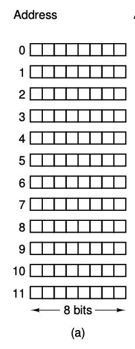

# Chapter 1. Introduction
## 1.1. Introduction
Computer science is *not* about computers. It's the science of computing: how to compute (or calculate, process) data correctly, fast, and efficiently.

```

                  +---------------+
                  |               |
                  |               |
      INPUT +---> |   Computing   +---> OUTPUT
                  |               |
                  |               |
                  +---------------+


```

How to represent, or model, data? Data Structures.
Steps to transform input data to output data: Algorithms.

Algorithms need to:
- correct: provides expected output
- fast: quickly to provide output, especially when the input size is large
- efficient: not wasting hardware resources

Coming up with the right data structures for your data is 50% of the work. Many times the correct algorithms just emerges naturally after you have the data structures.

"Worry about the data structures first, and your code will naturally be cleaner." - Linus Torvalds, probalbly.
"Bad programmers worry about the code. Good programmers worry about data structures and their relationships." - same man.

Examples of data structures: list, class, dictionary, etc.
Examples of algorithms:
- Steps to cook rice: 1. Wash the rice. 2. Fill the water. 3. Press cook button.
- Search an number in a list

## 1.2. Programming Fundamentals
```Python
# Variables
name = "Dave"  # name: variable name, "Dave": variable value
country = "Vietnam"
boiling_point = 100

# Function: take input, return output
def add(a, b):
    return a + b
def say(name):
    print(name) # Both input and return are optional!
```

Data type: a data type defines which values a variable can take, and which operations can be operated on those values
There are 2 types of data types:
- Primitive data types: types are built-in, provided by language creators
- Abstract data types: types are constructed from built-ins, usually from language users

*The difference between data type and data structure?*
- Data structures represent structures of a real world data. It's language-independent.
- Data types are language-dependent. A data type is a construct for its variables:
    - What values the variables can take
    - What operations can be operated on the variables.

Data structures are used to implement complex, or non primitive, data types.

### Built data types
```Python
number = 1
str = "I am a string"
character = 'c'
is_it_true = True # boolean
is_it_false = False # boolean
a_ist = [1, 2, 3]
a_dict = {"name": "Dave", age: 30}
```
See more at https://docs.python.org/3/library/stdtypes.html

### Class
How to represent a laptop in Python?
Try to describe it in natural language fist:
- What's brand? Apple
- What's color? Silver
- What's price? $1,000
- What's serial number? 12324433224

brand, color, price, and serial_number are *attributes* of the Laptop class.

From a class we can *instantiate* multiple objects:
- apple macbook air is an object of the Laptop class
- lenovo thinkpad is an object of the Laptop class

To tell an object to do something, we call its *method*. Examples of methods for the Laptop class:
- start()
- stop()
- explode()

```Python
class Laptop:
    def __init__(self, brand, color, price, serial_number):
        """ This is a special method named constructor"""
        self.brand = brand
        self.color = color
        self.price = price
        self.serial_number = number

    def tell_me_your_color(self):
        """ `self` is a special variable arguments of every methods. It holds the current object
        Every method should start with `self`, unless you want a static method"""
        print(self.color)

apple = Laptop("Apple", "silver", 1000, 123455667)
xiao_mi = Laptop("Xiao Mi", "silver", 1000, 33434325325)

apple.tell_me_your_color()
xiao_mi.tell_me_your_color()
```

### Exercise
1. Define a class called Animal, and instantiate a dog, cat, and fish objects.
2. Define method `legs()` for the `Animal` class, which print out number of legs for the animal.

## 1.3. Binary Search
Given a list of unique, sorted numbers, find the index of number 10 in the list
For example:
Input: [1, 2, 3, 4, 5, 7, 10, 26], output should be 7
Input: [1, 2,  99, 333], output should be None
Input: [10, 11, 22, 33], output should be 0

Naive solution:
Go over each number from left to right and compare it to 10.

Problem: what if the list is huge (1,000,000), and 10 is at the end of the list, or worse, not in the list?
Number of comparisons: 1,000,000

Solution: binary search:
```
1. Find the middle number and cut the list into halves: left and right
2. If 10 < middle number: it should be in the left half. Otherwise it should be in the right half
3. Repeat step 1 with the left or right list.
```
Number of comparisons: log(1,000,000) = 10.


# Home Works
1. Implement naive search
```Python
def naive_search(numbers, 100):
    your code here
```

2. Implement binary search
```Python
def binary_search(numbers, 100):
    # hints: recursion
    # to generate a large list of numbers for testing: numbers = list(range(100000))
```

# Chapter 2
## 2.1 Introduction to Random Access Memory (RAM)
Data need to be loaded into RAM before the CPU can fetch it. CPU instructions then store output data back to RAM.

RAM consists of a number of *cells* (or locations), each can store a piece of information.

Each cell has a number, called *address*, by which programs can refer to it.

If a memory has `n` cells, the addresses range from `0` to `n-1`.

All cells have contain the same number of bits. That means all cells have the same size.

If a cell consists of `k` bits, there will be possibly `2^k` number of addresses.

Data in a RAM cell can be accessed instantly by referring to its address.



## 2.2 Array
Array is one data structure to represent the list data type.

In an array, elements are stored next to each other in RAM. The benefits is accessing an element is instantly. The downsize is inserting/deleting an element requires shifting other elements, which is expensive in the worst case.

Array elements have the same size.

If RAM has 8-bit cells, or 1-byte, and an array's element size is also 1-byte, each element fits nicely inside 1 RAM cell.

If the array's element size is less than 1-byte, can we fit more than 1 elements to a cell? The answer is no. Each element still takes on cell. Cell is the atomic storage unit. We can divide it further.

If the array's element is 2-bytes, each element will take 2 cells.

## 2.3 Linked List
Linked list is another data structure to represent the list data type.
A linked list consists a list of nodes where they are linked to each other:
- Each node contains a value section to store the actual data, and a NEXT pointer
- The NEXT pointer of each node points to the next node in the linked list.


## 2.4 Leetcode.com
We'll use leetcode.com for exercises and homeworks. Try to get your submissions pass all the test cases, which indicate your algorithms are fast!
